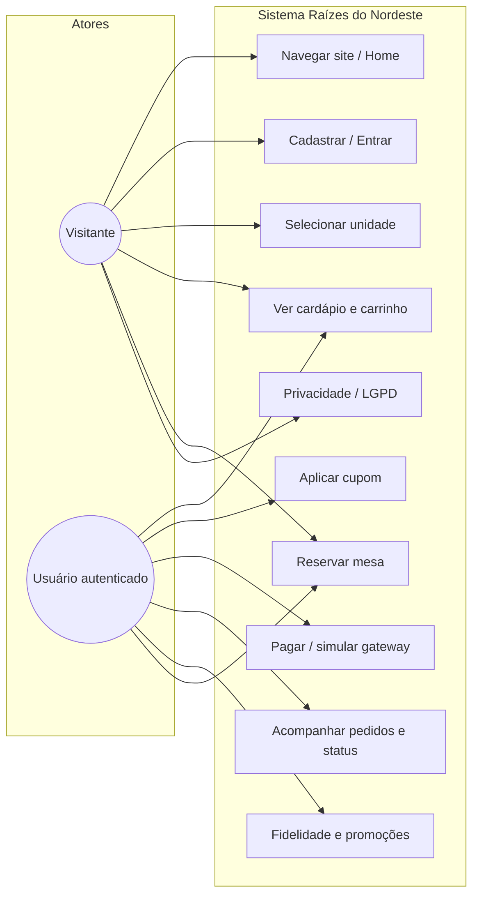
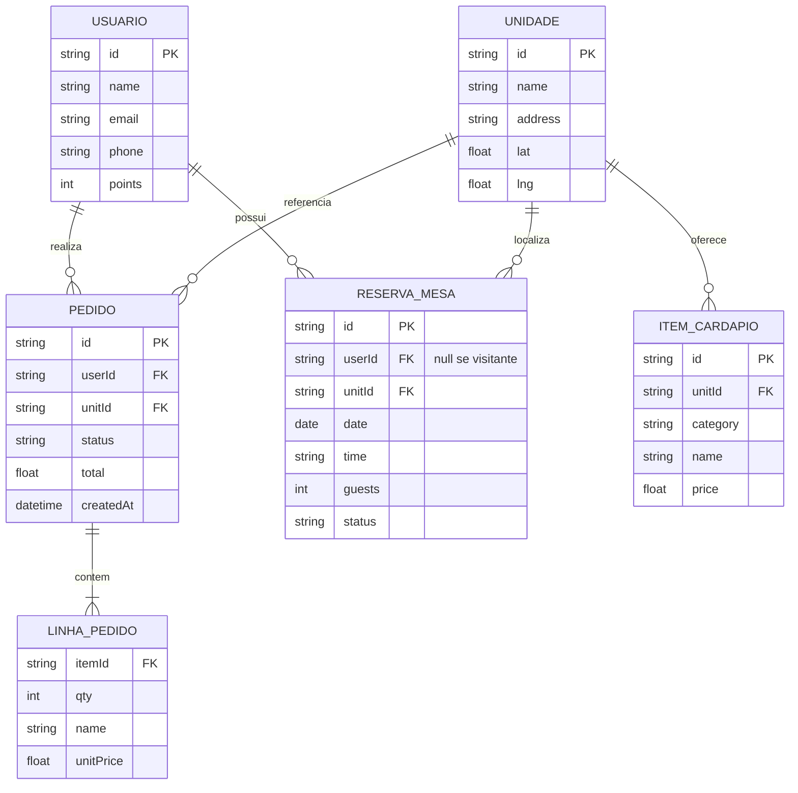
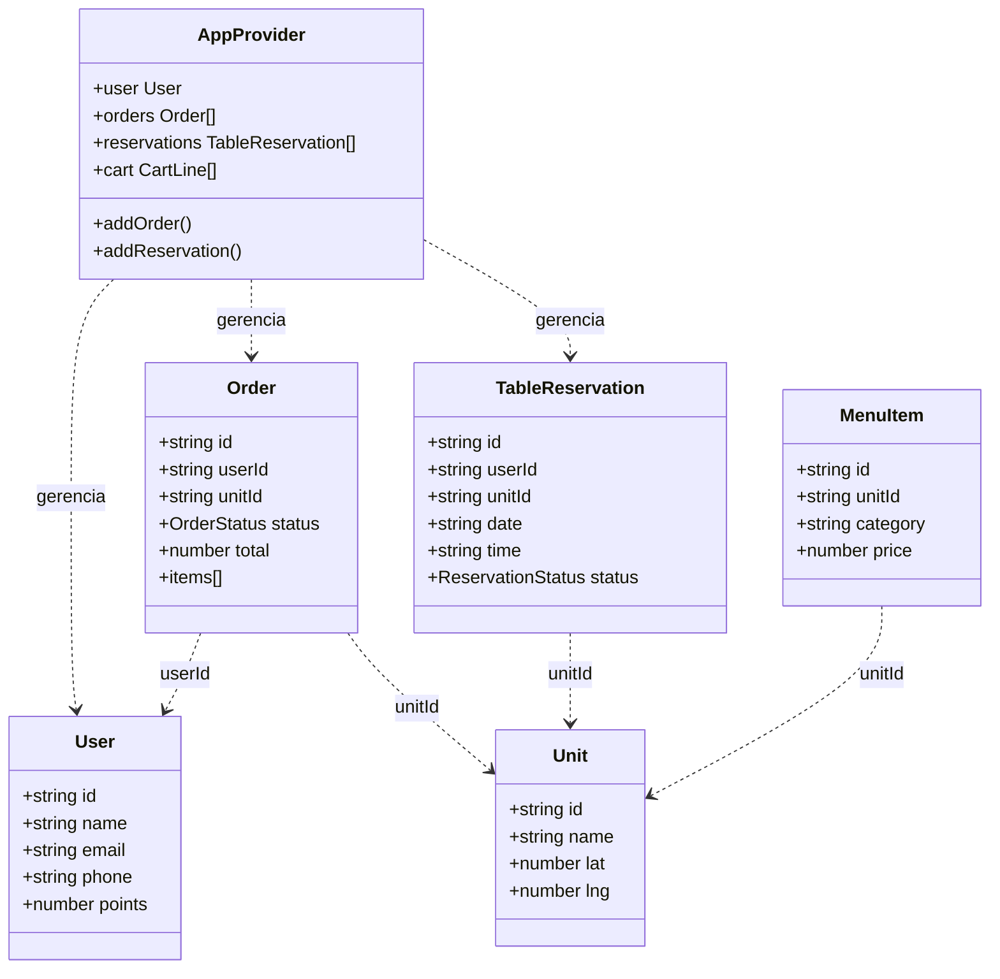

# Documentação do Projeto — Raízes do Nordeste

**Disciplina / Projeto final — Front-End**  
**Autor:** Pedro Afonso Barreto Fonseca de Oliveira  
**RU:** 1992822  

---

## SUMÁRIO

| | Pág. |
|---|:---:|
| **1. INTRODUÇÃO** | 3 |
| 1.1. Objetivo geral | 3 |
| 1.2. Objetivos específicos | 3 |
| 1.3. Justificativa | 3 |
| **2. REQUISITOS** | 4 |
| 2.1. Requisitos funcionais | 4 |
| 2.2. Requisitos não funcionais | 5 |
| 2.3. Apoio de inteligência artificial | 5 |
| **3. IMPLEMENTAÇÃO** | 6 |
| 3.1. Diagrama de Casos de Uso | 6 |
| 3.2. DER | 7 |
| 3.3. Diagrama de Classes | 8 |
| **4. PLANO DE TESTES** | 9 |
| 4.1. Linguagens e tecnologias do projeto | 9 |
| 4.2. Arquitetura do projeto | 10 |
| 4.3. Partes do código | 11 |
| 4.4. Resultados dos testes | 15 |
| 4.5. Link do GitHub | 19 |
| **5. CONCLUSÃO** | 20 |

*Nota: as páginas do sumário correspondem à numeração sugerida para o PDF final; ajuste no editor de texto após exportar para PDF, se necessário.*

---

## 1. INTRODUÇÃO

O presente documento descreve o **protótipo front-end** da aplicação web **Raízes do Nordeste**, uma rede fictícia de restaurantes com culinária regional nordestina. Os dados são **mockados** em arquivos TypeScript (`mock.ts`) e a persistência é simulada no **navegador** (`localStorage` e `sessionStorage`), adequado a um cenário acadêmico e de demonstração. O repositório de código encontra-se na pasta **`webapp/`**, contendo o projeto **React + TypeScript + Vite**.

### 1.1. Objetivo geral

Desenvolver uma **aplicação web front-end**, responsiva e navegável por rotas, que simule o **atendimento digital** de uma rede de restaurantes temática (**Raízes do Nordeste**), integrando **pedido por cardápio**, **carrinho e checkout**, **pagamento externo fictício**, **acompanhamento de pedidos**, **programa de fidelidade**, **promoções**, **tratamento de privacidade (LGPD)** e **reserva de mesa**, comprovando o domínio de **HTML/CSS**, **TypeScript**, **React** e **boas práticas de organização de código**, **sem dependência de servidor ou banco de dados real**.

### 1.2. Objetivos específicos

1. Implementar **cadastro e login** simulados com persistência local e fluxos de navegação coerentes.  
2. Permitir a **escolha da unidade** e a exibição do **cardápio** filtrado por unidade, com categorias e itens vindos de dados mock.  
3. Disponibilizar **carrinho de compras** com cálculo de subtotal, desconto e aplicação de **cupons promocionais**.  
4. Simular o **checkout** e uma tela de **pagamento de parceiro externo**, gerando **pedido** com identificação e **status** acompanhável.  
5. Exibir **histórico de pedidos** e **linha do tempo de status**, com possibilidade de simular avanço no fluxo demonstrativo.  
6. Apresentar **fidelidade** (pontos) e **página de promoções** alinhadas às regras definidas no mock.  
7. Incluir **banner e página de privacidade** e **consentimento** no cadastro, em linha com a **LGPD** em nível educativo.  
8. Oferecer **reserva de mesa** com formulário, galeria e mapas, e persistência das reservas para o usuário logado.  
9. Garantir **layout responsivo**, **build** com Vite/TypeScript sem erros e estrutura de pastas **escalável e documentada**.

### 1.3. Justificativa

A **culinária nordestina** e o **comércio de alimentação** são temas próximos do cotidiano brasileiro; um protótipo nesse contexto torna o trabalho **compreensível** para avaliadores e **motivador** para o discente, ao associar aprendizado técnico a um domínio de negócio real (pedido, retirada, fidelidade, promoções).

Do ponto de vista **pedagógico**, o escopo **somente front-end** é **justificado** pelo foco da disciplina em **interface, roteamento, estado na camada cliente e experiência do usuário**, sem exigir infraestrutura de API ou SGBD — o que reduz complexidade operacional e mantém o esforço concentrado em **React**, **TypeScript**, **CSS** e **persistência simulada**, ainda assim permitindo discutir **modelo de dados lógico**, **fluxos de uso** e **privacidade**.

A inclusão de **LGPD**, **cupons** e **reservas** responde à **exigência de um sistema mais completo** do que uma vitrine estática, aproximando o projeto de **aplicações reais** de restaurantes e delivery. O uso de **ferramentas modernas** (Vite, React 19) alinha o trabalho ao **mercado** e facilita **publicação** (Netlify/Vercel) e **portfólio**.

Por fim, a **justificativa metodológica** para dados mockados e armazenamento local é a **reprodutibilidade** da avaliação (qualquer máquina com Node/npm executa o projeto) e a **transparência** de que se trata de **demonstração**, não de sistema em produção — coerente com a declaração de limitações e com o caráter **acadêmico** do entregável.

---

## 2. REQUISITOS

### 2.1. Requisitos funcionais

| ID | Descrição |
|----|-----------|
| RF01 | Permitir **cadastro** e **login** de usuário (simulado; senha armazenada apenas para demo). |
| RF02 | Exibir **unidades** da rede e permitir **selecionar** uma unidade para o pedido. |
| RF03 | Exibir **cardápio** filtrado pela unidade escolhida, com categorias e itens com preço e descrição. |
| RF04 | Manter **carrinho** com inclusão, alteração de quantidade e remoção de itens. |
| RF05 | Aplicar **códigos promocionais** no carrinho (desconto ou pontos, conforme regra mock). |
| RF06 | Realizar **checkout** com totais, desconto e encaminhar para fluxo de **pagamento externo fictício**. |
| RF07 | Registrar **pedidos** com status (recebido → em preparo → pronto → entregue) e permitir **acompanhamento** e simulação de avanço. |
| RF08 | Exibir programa de **fidelidade** (pontos, resgates simulados). |
| RF09 | Exibir página de **promoções** e regras de cupons. |
| RF10 | Apresentar **banner LGPD**, página de **privacidade** e consentimento no cadastro. |
| RF11 | Permitir **reserva de mesa** por unidade, data e horário, com listagem e cancelamento para usuário logado. |
| RF12 | Exibir **página inicial** institucional com chamadas para pedido e reserva. |

### 2.2. Requisitos não funcionais

| ID | Descrição |
|----|-----------|
| RNF01 | Interface **responsiva** (mobile-first), utilizando CSS com breakpoints. |
| RNF02 | Navegação por **rotas** (`react-router-dom`), compatível com hospedagem SPA (redirect para `index.html`). |
| RNF03 | Código tipado com **TypeScript** para maior segurança de tipos. |
| RNF04 | **Build** reproduzível com `npm run build` (compilação TypeScript + bundle Vite). |
| RNF05 | Separação de **dados de demonstração** (`mock.ts`) da lógica de interface. |
| RNF06 | Aviso explícito de que **não há segurança real** de autenticação nem transações financeiras reais. |

### 2.3. Apoio de inteligência artificial

Este projeto utilizou **ferramentas de IA generativa** como **apoio** ao desenvolvimento e à documentação, em conformidade com as orientações da disciplina sobre transparência no uso de assistentes.

**Ferramentas (exemplos):** assistente de IA integrado ao ambiente de desenvolvimento (por exemplo, **Cursor** ou equivalente), empregado para **sugestões de código**, **padronização** de estilo (TypeScript/React), **estruturação de arquivos**, **textos** da interface, **README**, trechos da **documentação** e **diagramas** (PlantUML/Mermaid), além de **dicas** de acessibilidade e boas práticas.

**Papel da IA:** apoio auxiliar — **não substitui** a análise, o teste manual da aplicação nem a revisão final pelo autor. O discente **revisa**, **adapta** e **compreende** o código e os textos entregues, assumindo a **responsabilidade** pelo conteúdo do trabalho.

**Registro para a instituição:** quando exigido pelo professor ou pelo modelo de entrega da UNINTER, deve constar **qual ferramenta** foi usada, **com que finalidade** (ex.: documentação, refatoração, testes) e **trechos representativos** ou descrição dos prompts — este item pode ser anexado ao relatório em formulário próprio da disciplina.

---

## 3. IMPLEMENTAÇÃO

### 3.1. Diagrama de Casos de Uso

O diagrama abaixo representa os principais casos de uso e atores. **Visitante** pode navegar, ver cardápio (com unidade selecionada) e reservar informando dados; **Usuário autenticado** acessa pedidos, fidelidade e gestão de reservas vinculadas à conta.



*Para o PDF: exporte este diagrama como imagem (por exemplo [Mermaid Live Editor](https://mermaid.live)) e insira no lugar do bloco de código, se o seu editor não renderizar Mermaid.*

### 3.2. DER (Modelo de dados lógico)

Não há banco de dados servidor; o DER abaixo reflete as **entidades lógicas** e relacionamentos persistidos ou referenciados no cliente. **MenuItem** e **Unit** vêm de dados estáticos; **User**, **Order**, **TableReservation** são persistidos em `localStorage` (chaves `rdn_*`).



*Observação: `LINHA_PEDIDO` está embutida como array JSON dentro de `PEDIDO` na implementação atual.*

### 3.3. Diagrama de Classes

Visão simplificada dos **tipos principais** (`types.ts`) e do **contexto da aplicação** (`AppContext`). As páginas React consomem o hook `useApp()`.



---

## 4. PLANO DE TESTES

### 4.1. Linguagens e tecnologias do projeto

| Tecnologia | Uso |
|------------|-----|
| **HTML5** | Estrutura base (`index.html`). |
| **CSS3** | Estilos globais e responsivos (`global.css`). |
| **TypeScript** | Tipagem estática e organização dos módulos. |
| **React 19** | Componentes funcionais e interface. |
| **React Router DOM 7** | Rotas SPA (`BrowserRouter`, `Routes`, `Route`). |
| **Vite 8** | Dev server e build de produção. |

### 4.2. Arquitetura do projeto

Fluxo em camadas:

1. **Entrada:** `main.tsx` monta `App` com `BrowserRouter`.
2. **Rotas:** `App.tsx` define URLs e associa cada uma a uma **página** em `src/pages/`.
3. **Layout:** `Layout.tsx` envolve todas as rotas (cabeçalho, menu, rodapé, banner LGPD).
4. **Estado global:** `AppProvider` (`AppContext.tsx`) centraliza usuário, carrinho, pedidos, reservas, unidade selecionada e persistência em `localStorage`.
5. **Dados estáticos:** `src/data/mock.ts` (cardápio, unidades, promoções) e `sitePhotos.ts` (imagens).
6. **Bibliotecas auxiliares:** `src/lib/` (`auth.ts`, `cart.ts`, `format.ts`, `maps.ts`).

```
webapp/src/
  App.tsx          → rotas
  main.tsx         → bootstrap React
  context/AppContext.tsx
  components/      → Layout, Logo, RestaurantFloorPlan
  pages/           → telas por rota
  data/            → mock, sitePhotos, siteMeta
  lib/             → regras auxiliares
  styles/global.css
```

### 4.3. Partes do código

| Área | Arquivo(s) principal(is) | Função |
|------|---------------------------|--------|
| Rotas e shell | `App.tsx`, `main.tsx` | Definição de caminhos e provedor global. |
| Estado e persistência | `context/AppContext.tsx` | Carrinho, sessão, pedidos, reservas, LGPD. |
| Tipos | `types.ts` | Contratos de `User`, `Order`, `TableReservation`, etc. |
| Cardápio e unidades | `data/mock.ts` | `UNITS`, `MENU`, promoções, horários de reserva. |
| Autenticação simulada | `lib/auth.ts`, `pages/AuthPage.tsx` | Login/registro em `localStorage`. |
| Carrinho e totais | `lib/cart.ts`, `pages/CartPage.tsx` | Cálculo de subtotal, desconto, cupom. |
| Pagamento | `pages/PaymentPage.tsx` | Fluxo fictício de gateway e criação de pedido. |
| Pedidos | `pages/OrdersPage.tsx`, `OrderDetailPage.tsx` | Lista e linha do tempo de status. |
| Reservas | `pages/ReservationsPage.tsx`, `lib/maps.ts` | Formulário, galeria, mapas Google embed. |
| Fidelidade / Promoções | `pages/LoyaltyPage.tsx`, `PromosPage.tsx` | Regras mock de pontos e cupons. |
| Privacidade | `pages/PrivacyPage.tsx` | Texto LGPD. |
| Identificação do autor | `data/siteMeta.ts` | Nome e RU no rodapé. |

### 4.4. Resultados dos testes

**Testes manuais recomendados (checklist)**

| # | Cenário | Resultado esperado |
|---|---------|---------------------|
| 1 | Abrir `/` | Home carrega com imagens e links. |
| 2 | Cadastrar em `/auth` | Usuário salvo; redirecionamento conforme fluxo. |
| 3 | Escolher unidade em `/unidades` | Unidade persistida; cardápio filtrado em `/cardapio`. |
| 4 | Adicionar itens ao carrinho | Contador no header; totais corretos em `/carrinho`. |
| 5 | Aplicar cupom (ex.: `SUCO10`) | Desconto ou mensagem de erro coerente. |
| 6 | Concluir `/pagamento` | Pedido criado; pontos atualizados se aplicável. |
| 7 | `/pedidos` e `/pedido/:id` | Lista e timeline de status. |
| 8 | `/reservas` | Reserva salva; lista para usuário logado. |
| 9 | `/privacidade` e banner LGPD | Texto acessível; banner pode ser dispensado. |
| 10 | Rota inexistente | `NotFoundPage`. |

**Build de produção**

Comando executado na pasta `webapp/`:

```bash
npm run build
```

Esperado: `tsc` sem erros e `vite build` gerando pasta `dist/` com `index.html` e assets. O desenvolvedor deve registrar aqui a **data** e o **resultado** de cada execução ao entregar o trabalho.

Exemplo de saída bem-sucedida (execução local com `npm run build`):

```
> webapp@0.0.0 build
> tsc && vite build

vite v8.0.8 building client environment for production...
✓ 48 modules transformed.
dist/index.html                   ~1 kB
dist/assets/index-*.css           ~39 kB
dist/assets/index-*.js            ~289 kB
✓ built in ~350ms
```

*Os nomes exatos dos arquivos hash em `dist/assets/` mudam a cada build.*

### 4.5. Link do GitHub

**Repositório público:** _[inserir após publicar — formato `https://github.com/usuario/repositorio`]_

**Publicação online (opcional):** _[inserir URL Netlify/Vercel ou similar]_

Instruções rápidas: criar repositório no GitHub, enviar a pasta `webapp/` (ou a raiz do projeto), configurar deploy com **base directory** `webapp`, **build** `npm run build` e **publish** `dist`, com redirect SPA para `index.html`.

---

## 5. CONCLUSÃO

O projeto **Raízes do Nordeste** cumpre os requisitos de um front-end demonstrativo para uma rede de restaurantes regionais: fluxo de pedido completo, fidelidade, promoções, tratamento de LGPD, reservas e interface responsiva, sem dependência de servidor próprio. A escolha por **React**, **TypeScript** e **Vite** facilita manutenção e evolução futura (integração com API real, autenticação segura e gateway de pagamento).

As limitações são explícitas: dados e pagamentos são **fictícios**; o trabalho tem caráter **acadêmico**. Como extensões possíveis, citam-se backend REST, banco relacional alinhado ao DER, testes automatizados (por exemplo Vitest + Testing Library) e acessibilidade avançada (WCAG).

---

**Fim do documento.**
